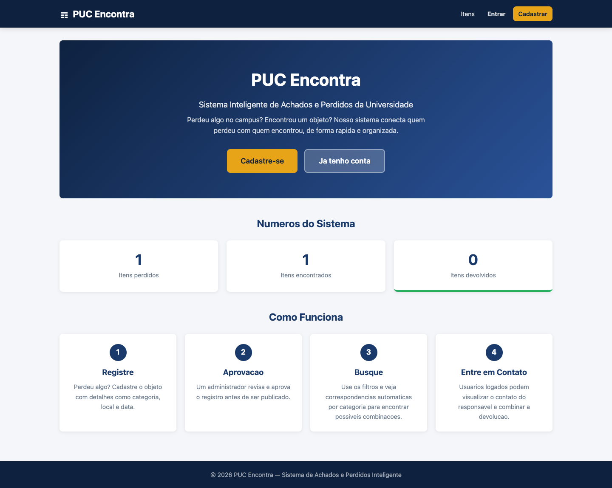
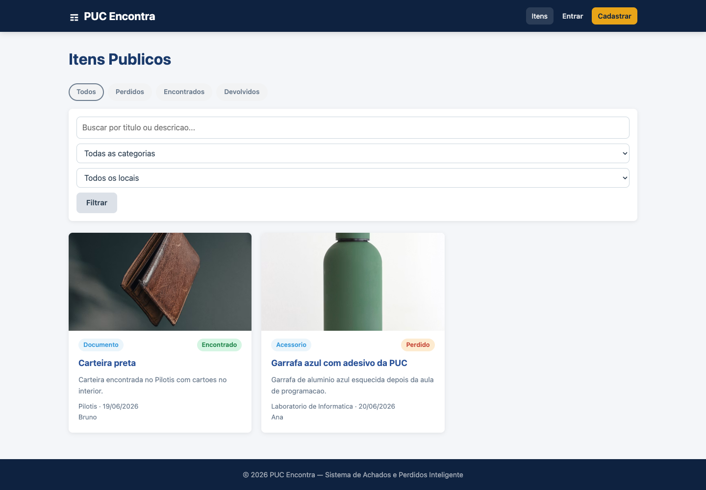
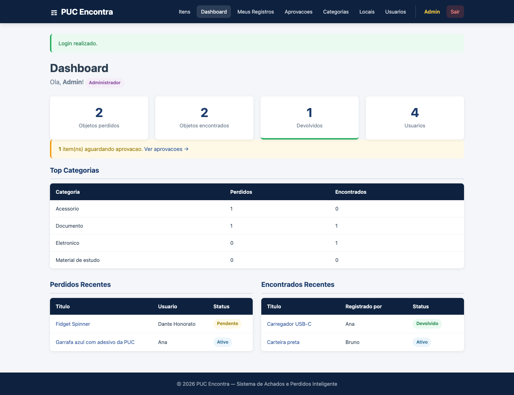
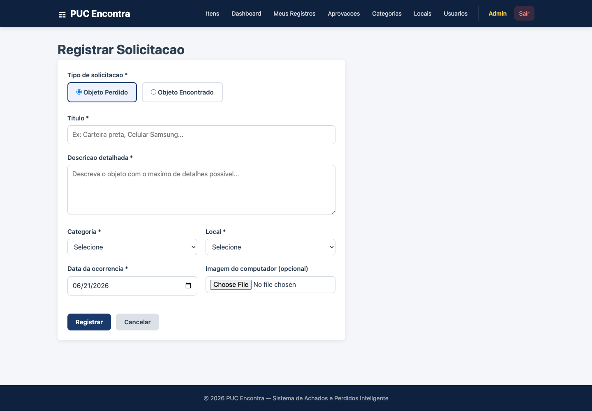

# Segundo Trabalho de Programacao para Web - PUC-Encontra Frontend

Frontend do PUC-Encontra, uma plataforma web de achados e perdidos para a PUC. A aplicacao permite consultar itens publicos, cadastrar usuario, fazer login, registrar objetos perdidos ou encontrados, gerenciar os proprios registros e acessar telas administrativas quando o usuario logado e administrador.

## Integrantes

- Dante Navaza 2321406
- Rafael Soares

## Links

- Repositorio do frontend: [https://github.com/Raafaael/PUC-Encontra-FrontEnd](https://github.com/Raafaael/PUC-Encontra-FrontEnd)
- Repositorio do backend: [https://github.com/Raafaael/PUC-Encontra-API](https://github.com/Raafaael/PUC-Encontra-API)
- Frontend local: [http://127.0.0.1:5173/](http://127.0.0.1:5173/)
- Backend local: [http://127.0.0.1:8000/api/](http://127.0.0.1:8000/api/)
- Site frontend publicado: COLOCAR LINK PUBLICO

## Escopo

O frontend foi desenvolvido com HTML, CSS e TypeScript. O JavaScript usado pelo navegador e gerado pelo compilador TypeScript no diretorio `dist/`.

Funcionalidades implementadas:

- Pagina inicial publica.
- Listagem publica de itens perdidos, encontrados e devolvidos.
- Filtros por texto, categoria, local e tipo.
- Login e cadastro de usuario.
- Logout.
- Dashboard para usuario comum.
- Dashboard para administrador.
- Cadastro, edicao e exclusao de objetos.
- Upload de imagem local pelo computador.
- Visualizacao detalhada de objeto.
- Lista de "Meus Registros".
- Troca de senha.
- Recuperacao de senha.
- Edicao de perfil.
- Desativacao de conta.
- Area administrativa para aprovar ou rejeitar objetos pendentes.
- CRUD administrativo de categorias.
- CRUD administrativo de locais.
- CRUD administrativo de usuarios.
- Navegacao com URLs reais, como `/login`, `/explorar`, `/meus-registros` e `/objetos/1`.

## Tecnologias

- HTML
- CSS
- TypeScript
- Fetch API
- LocalStorage para armazenar token de autenticacao
- Servidor estatico Node `serve` para desenvolvimento local

## Instalacao Local

Clone o repositorio:

```bash
git clone https://github.com/Raafaael/PUC-Encontra-FrontEnd.git
cd PUC-Encontra-FrontEnd
```

Instale as dependencias:

```bash
npm install
```

Compile o TypeScript:

```bash
npm run build
```

Execute o servidor local:

```bash
npm run serve
```

Acesse:

```text
http://127.0.0.1:5173/
```

## Backend Necessario

O frontend espera que a API esteja rodando em:

```text
http://127.0.0.1:8000/api
```

Para rodar o backend localmente:

```bash
cd ../PUC-Encontra-API
source .venv/bin/activate
SERVE_MEDIA=True python manage.py runserver 127.0.0.1:8000
```

Antes disso, o backend deve ter as migracoes e o seed aplicados:

```bash
python manage.py migrate
python manage.py seed
```

## Usuarios de Teste

Todos os usuarios criados pelo seed usam a senha:

```text
PucEncontra123
```

Usuarios:

```text
admin   - Administrador
aluno1  - Usuario comum
aluno2  - Usuario comum
```

## Manual do Usuario

Fluxo publico:

1. Abra DPS COLOCAR LINK PUBLICO DO SITE!!!.
2. Clique em "Itens" ou acesse `/explorar`.
3. Use os filtros para procurar objetos por texto, categoria, local ou tipo.
4. Clique em um objeto para abrir a pagina de detalhes.

Fluxo de usuario comum:

1. Acesse `/login`.
2. Entre com `aluno1` e senha `PucEncontra123`.
3. Abra o dashboard para ver os seus registros e possiveis correspondencias.
4. Acesse "Meus Registros" para editar ou excluir seus objetos.
5. Clique em "Registrar Solicitacao" para cadastrar um objeto perdido ou encontrado.
6. Selecione uma imagem local do computador no campo "Imagem do computador".
7. Acesse "Perfil" para editar dados, trocar senha ou desativar a conta.

Fluxo de administrador:

1. Acesse `/login`.
2. Entre com `admin` e senha `PucEncontra123`.
3. Use o dashboard para acompanhar pendencias e estatisticas.
4. Acesse "Aprovacoes" para aprovar ou rejeitar objetos pendentes.
5. Acesse "Categorias" para criar, editar e excluir categorias.
6. Acesse "Locais" para criar, editar e excluir locais.
7. Acesse "Usuarios" para criar e editar usuarios administrativos ou comuns.

## Rotas Principais

```text
/                 - Pagina inicial
/explorar         - Listagem publica
/login            - Login
/cadastro         - Cadastro
/dashboard        - Dashboard do usuario logado
/meus-registros   - Registros do usuario logado
/registro         - Formulario de objeto
/objetos/{id}     - Detalhe de objeto
/perfil           - Perfil
/trocar-senha     - Troca de senha
/redefinir-senha  - Recuperacao de senha
/aprovacoes       - Area administrativa
/categorias       - CRUD de categorias
/locais           - CRUD de locais
/usuarios         - CRUD de usuarios
```

## Imagens

Pagina inicial:



Listagem publica:



Dashboard administrativo:



Formulario com upload de imagem:



## O Que Foi Testado e Funcionou

Testado localmente em 21/06/2026:

- `npm install` instalado sem vulnerabilidades reportadas.
- `npm run build` executado com sucesso.
- Servidor local Node abriu em `http://127.0.0.1:5173/`.
- Rotas diretas funcionaram com refresh:
  - `/login`
  - `/explorar`
  - `/objetos/1`
- Login de administrador funcionou.
- Tela de dashboard administrativo abriu.
- Formulario de objeto mostra apenas upload de imagem local.
- O backend aceitou upload de imagem e retornou URL em `/media/...`.
- A imagem enviada abriu com `200 image/png`.
- Telas de CRUD administrativo estao acessiveis para admin.
- Usuario comum nao acessa area administrativa.

## O Que Nao Funcionou ou Esta Pendente

- Publicacao em provedor web ainda nao foi realizada.
- A URL da API esta fixa em `src/config.ts` como `http://127.0.0.1:8000/api`; para producao, deve ser alterada para a URL publicada do backend.
- Ainda nao ha testes automatizados do frontend; a validacao foi feita por build, navegador e chamadas reais ao backend.
- O envio real de e-mail para recuperacao de senha depende da configuracao futura do backend.

## Comandos de Validacao

```bash
npm run build
npm run serve
```

Com o backend rodando, acessar:

```text
"DEPOIS COLOCAR LINK
```

## Observacoes Para Entrega

Para atender integralmente ao PDF, antes do envio no EaD ainda e necessario publicar o frontend em um provedor web e substituir o item "Site frontend publicado" pelo link final.
